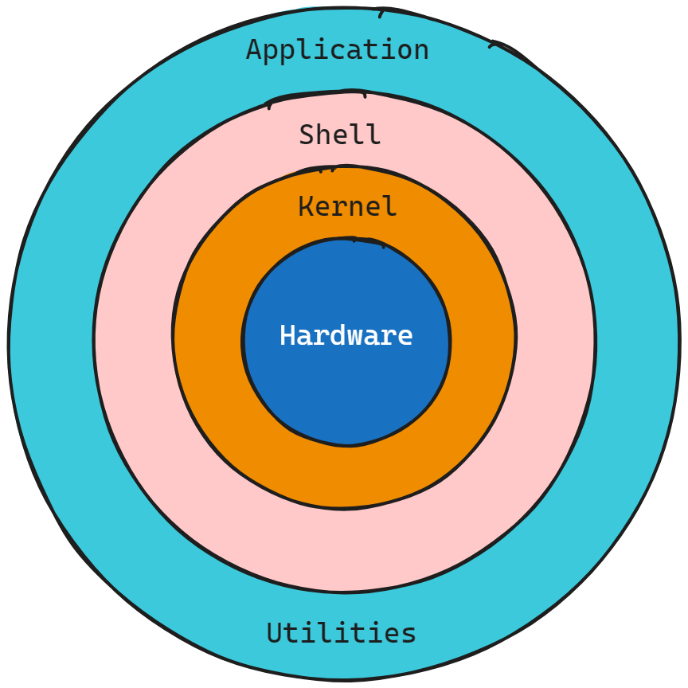

# Mastering Shell Scripting Fundamentals
This documentation introduces the fundamentals of **shell scripting**, **covering essential concepts**, **command** & **examples**. Learn how to automate tasks, manage systems & enhance productivity in Unix-based environments with variables, loops & functions.
<div align="center">
    
</div>

# What is Linux Shell?
A **Linux Shell** is a **command-line interpreter** that **processes user commands & scripts**, acting as an interface between the Applications and the Operating System. Examples include **`bash`**, **`sh`** & **`zsh`**.
<div align="center">
    
</div>

# What is Shell Script?
A **shell script is a text file** containing a **sequence of shell commands**. It is executed by a shell interpreter like **`bash`**, **`sh`** or **`zsh`**.
# What is Shell Scripting?
**Shell Scripting** is the **process of writing** and **creating shell scripts**. It involves using **shell syntax** & **commands** to **develop automation scripts** that **perform tasks** **on the system**. It involves **writing scripts using shell commands** to **perform a series of tasks**.
# Use Cases of Shell Scripting
1. **Automate Repetitive Tasks** - Save time by automating backups, installations & updates.
2. **Simplify Commands** - Combine multiple commands into a single script.
3. **System Administration** - Manage users, files & services efficiently.
4. **Periodic Monitoring** - Automatically check system health regularly.
5. **Alerts and Notifications** - Get alerts for issues like low disk space.
6. **Troubleshooting and Audits** - Identify problems and maintain logs.
# Pre-Requisites 
1. Linux Basics.
2. Command Line Basics
3. No Programming Knowledge Required.
# How to Check Shell Name?
Open a **Terminal** on **Linux** & **Run**
```bash
    echo $0
```
The Output will show the **`bash`** name of Current Linux Operating System.
# First Shell-Script
Here are the steps to create and run your first shell script from scratch :
## Step 1 : Create a Text Editor to Create a Script
```bash
    vim first-script.sh
```
## Step 2 : Write the Following Content Inside the File
```bash
    echo "Hi, I am Pritam"
    echo "This is my first script"
    pwd
    ls -l
```
Save & Exit.
## Step 3 : Make the Script Executable 
Change the **script's permissions** to make it **executable**
```bash
    chmod +x first-script.sh
```
## Step 4 : Run the Script
```bash
    ./first-script.sh
```
If everything is done correctly, the script should run and execute the commands within it.
## Step 5 : Check the Output
The output will be shown like this :
> **Output** 
```bash
    Hi, I am Pritam
    This is my first script
    /home/username/my_first_script
    total 4s
    -rwxr-xr-x 1 pritam pritam 66 Dec 1 15:28 first-script.sh
```
# Best Practice for Script Name
1. Give your Script a name that makes sense.
    - **Good Example** - `my-name`
    - **Bad Example** - `script.sh`; `myscript.sh`;`test.sh`
2. Leave out **`.sh`** extension for executables.
     - **Good Example** - `my-name`
     - **Bad Example** - `script.sh`; `myscript.sh`;`test.sh`
# Shebang(`#!`) for Shell Scripting
The **shebang** (**`#!`**) is the **first line** in a **shell script** that **specifies the interpreter to execute the script**. It tells the system which **shell** or **interpreter** to **use for executing the script**.
## Syntax 
```bash 
    #!/path/to/interpreter
```
The **`#!`** is followed by the **Absolute Path** of the **interpreter**.
## Examples 
### 1. Use **`which`** to find the interpreter's path 
```bash
    which bash
```
Or,
```bash
    which python3
```
### 2. Add the Path of Interpreter as Shebang to the Script
If you're using **`bash`** your script starts with :
```bash
    #!/bin/bash 
```
**`bash`** is default on most Linux Systems.

If using zsh, your script starts with :
```bash
    #!/bin/zsh
```
For Python
```bash
    #!/usr/bin/python3
```
### Example of a Python Script
```bash
    #!/usr/bin/python3
    # Python code to print a name
    print("Hi, I am Pritam")
```
**Note :** The script is saved with a **`.sh`** extension, but it behaves as a Python script due to the interpreter in the shebang.
## Why Shebang is Important?
1. Using which avoids hardcoding incorrect or unavailable paths.
2. The shebang ensures the script runs with the specified interpreter, even if another shell is active.
3. Makes the script portable across systems with the same interpreter.

# Built-Ins
- **Definition** - Commands integrated directly into the shell (e.g., **`bash`**, **`zsh`**)
- **Execution** - Run by the shell itself not external programs, making them faster.
- **Storage** - Part of the shell's binary (e.g., **`/bin/bash`** or **`/usr/bin/zsh`**) and do not exist as standalone files.
- **Examples**-
    - **`echo`** - Prints text to the terminal.
    - **`cd`** - Changes directories.
    - **`export`** - Sets environment variables.
    - **`alias`** - Creates shortcuts for commands.
# Keywords
- **Definition** - Reserved words with special meanings in shell scripting, used to define the structure of scripts.
- **Usage** - Cannot be used as variable names or redefined.
- **Storage** - Keywords are hardcoded in the shell's binary and are not standalone files.
- **Examples**-
    - **`if, else, fi`** - Used for conditional execution.
    - **`for, while, do, done`** - Loop control.
    - **`function`** - Defines a reusable block of code.
    - **`case, esac`** - Multi-condition branching.
# Commands
- **Definition** - Instructions that perform specific tasks, either built-in or external programs.
- **Types and Storage** -
    - **Internal Commands** - Built into the shell, stored within the shell binary.
    - **External Commands** - Executable files located in system directories.
- **Common Storage Locations** -
    - **`/bin`** - Essential binaries (e.g., **`ls`**, **`pwd`**, **`cp`**).
    - **`/usr/bin`** - Additional user binaries (e.g., **`grep`**, **`curl`**, **`vim`**).
    - **`/usr/local/bin`** - User-installed binaries.
- **Examples** -
    - **`ls`** - **`/bin/ls`** - Lists directory contents.
    - **`grep`** - **`/usr/bin/grep`** - Searches for patterns in text.
    - **`curl`** - **`/usr/bin/curl`** - Transfers data from or to a server.
# Comments
Comments are lines of text ignored by the shell during script execution. They are used to explain the code making it easier to understand & maintain.

There are 2 Types of Comments :
1. Single-Line Comment
2. Multi-Line Comment
## Single Line Comment
- Begin with the **`#`** symbol.
- Everything after **`#** on the same line is treated as a comment.
### Single Line Comment Example 
```bash
    # This is a single-line comment
    echo "Hello, World!"  # This prints a message
```
## Multi Line Comment
Use **`<<Anything`** & Anything to enclose multiple lines. The important part is that the same identifier must be used to open and close the block.
### Multi Line Comment Example 
```bash
    <<Start
    This is a multi-line comment.
    It can span multiple lines.
    Start
```
### Important Terminology for Multi Line Comment
- The identifier must be consistent and unique within the script.
- Anything between the opening and closing identifiers will be treated as part of the here-document.
- Here-documents are not comments by design, but when used without being redirected (**`>`** or **`<`**), they effectively act as multi-line comments.
# `echo` Command
The **`echo`** command is used to display text or output strings in the terminal. It has various options to handle formatting, escape sequences & other customizations. Below are all the common types and usage of the echo command.
## Basic Usage 
### 1. Print a Simple String 
```bash 
    echo "Hello, World!"
```
### 2. Print without Quotes 
```bash 
    echo Hello, World!
```
## Options with `echo`
### 1. Newline Suppression (`-n`)
Prevents the newline at the end of the output.
```bash 
    echo -n "Hello, World!"
```
### 2. Enable Escape Sequences (`-e`)
Enables special characters like **`\n`**, **`\t`** and others
```bash 
    echo -e "Hello\nWorld!"  # Adds a newline
    echo -e "Column1\tColumn2"  # Adds a tab
```
### 3. Disable Escape Sequences (`-E`)
Ensures that escape sequences are treated as plain text
```bash
    echo -E "Hello\nWorld!"  # Prints: Hello\nWorld!
```
## Using Special Characters
### 1. Newline
```bash 
    echo -e "Line1\nLine2"
```
### 2. Tab 
```bash 
    echo -e "Column1\tColumn2"
```
### 3. Backlash 
```bash 
    echo -e "This is a backslash: \\"
```
### 4. Alert (Beep)
```bash 
    echo -e "\aThis triggers a beep sound."
```
### 5. Colored Text (ANSI Codes)
```bash
    #!/bin/bash

    # Print "Hello, World!" in different colors
    echo -e "\033[31mHello, World! in Red\033[0m"
    echo -e "\033[32mHello, World! in Green\033[0m"
    echo -e "\e[33mHello, World! in Yellow\e[0m"
    echo -e "\e[34mHello, World! in Blue\e[0m"
    echo -e "\e[35mHello, World! in Magenta\e[0m"
    echo -e "\e[36mHello, World! in Cyan\e[0m"
```
**Color Codes for Foreground Text**
- **`30`**	**Black**	\e[30mHello\e[0m
- **`31`**	**Red**	    \e[31mHello\e[0m
- **`32`**	**Green**	\e[32mHello\e[0m
- **`33`**	**Yellow**	\e[33mHello\e[0m
- **`34`**	**Blue**	\e[34mHello\e[0m
- **`35`**	**Magenta**	\e[35mHello\e[0m
- **`36`**	**Cyan**	\e[36mHello\e[0m
- **`37`**	**White**   \e[37mHello\e[0m
## Command Substitution
### 1. Print Command Output
```bash 
    echo "The current directory is: $(pwd)"
```
### 2. Inline Math
```bash 
    echo "The sum of 5 + 3 is: $((5 + 3))"
```
## Redirecting Output
### 1. To a File
```bash 
    echo "Saving this to a file.txt" > file.txt
```
### 2. Appending to a File
```bash 
    echo "Adding this line" >> file.txt
```
## Summary Table
| **Option/Usage**     | **Description**                        | **Example**                    | **Output**                    |
|-----------------------|----------------------------------------|--------------------------------|--------------------------------|
| `echo "text"`         | Print a simple string                 | `echo "Hello"`                | `Hello`                       |
| `-n`                 | Suppress newline                      | `echo -n "Hello"`             | `Hello` (no newline after)    |
| `-e`                 | Enable escape sequences               | `echo -e "Line1\nLine2"`      | `Line1`<br>`Line2`            |
| `-E`                 | Disable escape sequences              | `echo -E "Line\nTab"`         | `Line\nTab`                   |
| Redirect `>`         | Write output to a file                | `echo "Text" > file.txt`      | (Content saved to file)       |
| Append `>>`          | Append output to a file               | `echo "More" >> file.txt`     | (Content appended to file)    |
| Command substitution | Print the result of a command          | `echo $(pwd)`                 | Current directory path        |
# Variables 
A variable in scripting is a symbolic name used to store data or information. It allows scripts to manage dynamic values and reuse them throughout the program. Variables make scripts flexible, allowing customization without modifying the code repeatedly.
## 1. User-Defined Variables
A user-defined variable is a custom variable created by the user to store data or values that can be used within a script.
### a. Defining a Variable
```bash
    name=value
```
**Note** - No spaces around the **`=`** sign.
### b. Accessing a Variable
Use the **`$`** symbol
```bash 
    echo $name
```
### Example
```bash 
    #!/bin/bash

    # Define variables
    NAME="Pritam"
    AGE=25
    MESSAGE="Welcome to shell scripting!"

    # Use variables
    echo "My name is $NAME."
    echo "I am $AGE years old."
    echo "$MESSAGE"
```
### Use of Curly Braces "`{}`"
To avoid confusion or ambiguity when concatenating.
```bash 
    name="Shuvo"
    echo "My Name is Pritam{$name}"
```
## Rules for Naming Variable
- Must start with a letter or **`_`** (underscore).
- Can contain letters, numbers, and underscores (**`A-Z`**, **`a-z`**, **`0-9`**, **`_`**).
- Case-sensitive (**`NAME`** & **`name`** are different).
- Avoid using shell reserved words (e.g., **`if`**, **`then`**, **`else`**).
- Variables name cannot have Whitespace between.
- Variable name can not have special characters.
- The first character of the variable name cannot be a number.
## 2. Environment Variables
Environment variables are key-value pairs stored in the operating system's environment. They provide information that applications and scripts can use to configure their behavior or interact with the system.
### Key Features of Environment Variables
1. **Global Scope** : Accessible to all processes and subshells.
2. **System-Wide or User-Specific** : Defined for the entire system or individual users.
### Common Environment Variables
- **`$HOME**`**: User's home directory.
- **`$PATH**`**: Directories searched for executable files.
- **`$USER**`**: Logged-in username.
- **`$SHELL`**: The default shell for the user.
- **`$LANG**`**: Language/locale settings.
- **`$UID**`**: User ID of the current user.
- **`$PWD**`**: Current working directory.
- **`$OLDPWD`**: Previous working directory.
- **`$LOGNAME`**: Logged-in username.
- **`$HOSTNAME`**: Hostname of the system.
- **`$TERM`**: Terminal type.
- **`$TMPDIR`**: Path to temporary directory.
- **`$DISPLAY`**: Specifies the display screen for GUI applications.
- **`$LANGUAGE`**: Fallback language for messages.
- **`$SHLVL`**: Current shell level.
- **`$RANDOM`**: Generates a random number.
- **`$PS1`**: Primary prompt string.
- **`$PPID`**: Parent process ID of the current shell.
- **`$0`**: Name of the current script or shell.
- **`$EDITOR`**: Default text editor.
- **`$MAIL`**: Location of the user's mail directory.
- **`$MANPATH`**: Directories searched for manual pages.
- **`$PROMPT_COMMAND`**: Command executed before displaying the prompt.
- **`$COLUMNS`**: Number of columns in the terminal window.
- **`$LINES`**: Number of lines in the terminal window.
- **`$XDG_CONFIG_HOME`**: User-specific configuration files directory.
- **`$XDG_DATA_HOME`**: User-specific data files directory.
- **`$XDG_RUNTIME_DIR`**: User-specific runtime files and socket directory.
- **`$PATH_SEPARATOR`**: Character separating paths in $PATH.
- **`$SUDO_USER`**: User who invoked sudo.
- **`$SUDO_UID`**: User ID of the invoking user.
- **`$SUDO_GID`**: Group ID of the invoking user.
- **`$HISTFILE`**: Location of the shell history file.
- **`$HISTSIZE`**: Number of commands stored in history for the session.
- **`$HISTFILESIZE`**: Maximum number of commands stored in the history file.
- **`$TZ`**: Time zone setting.
- **`$LC_TIME`**: Locale settings for date and time formats.
- **`$LC_MESSAGES`**: Locale settings for system messages.
- **`$SESSION_MANAGER`**: Session manager information for GUI sessions.
# Taking Input from User
The **`read`** command is used in shell scripts to take input from the user. It allows you to prompt the user for data and store it in a variable for later use.
## Syntax of `read`
```bash
    read [options] variable_name
```
## Basic Input 
```bash
    #!/bin/bash
    echo "Enter your name:"
    read name
    echo "Hello, $name!"
```
## Input with a Prompt
Using the **`-p`** option allows you to display a prompt on the same line as the input request :
```bash
    #!/bin/bash
    read -p "Enter your age: " age
    echo "You are $age years old."
```
## Input Hidden (for passwords)
The **`-s`** option hides the input while typing (useful for passwords) :
```bash
    #!/bin/bash
    read -sp "Enter your password: " password
    echo
    echo "Password received!"
```
Or,
```bash 
    ```bash
    #!/bin/bash
    read -p "Enter your password: " -s password
    echo
    echo "Password received!"
```
## Read Multiple Inputs
You can read multiple inputs at once and store them in separate variables :
```bash
    #!/bin/bash
    read -p "Enter your first name: " first_name
    read -p "Enter your last name: " last_name
    echo "Your full name is $first_name $last_name."
```
## Default Value if No Input
Set a default value if the user does not provide input :
```bash
    #!/bin/bash
    read -p "Enter your favorite color (default is blue): " color
    color=${color:-blue}
    echo "Your favorite color is $color."
```
# Command Line Arguments
Command line arguments allow a shell script to accept input directly from the command line when the script is executed. These arguments are passed to the script as positional parameters.
## Special Variable for Command Line Arguments
- **`$0`**: The name of the script.
- **`$1`**, **`$2`**, **`$3`**, ...: Positional parameters representing the arguments.
- **`$#`**: The total number of arguments passed to the script.
- **`$@`**: All arguments as a list (each treated as a separate string).
- **`$*`**: All arguments as a single string.
- **`$?`**: Exit status of the last command.
- **`$$`**: Process ID of the current script.
## Example 1 : Basic Argument Handling
```bash
    #!/bin/bash
    echo "Script name: $0"
    echo "First argument: $1"
    echo "Second argument: $2"
```
**Run the Script** :
```bash 
    ./script.sh arg1 arg2
```
> **Output**
```bash 
    Script name: ./script.sh
    First argument: arg1
    Second argument: arg2
```
## Example 2 : Count Total Arguments
```bash 
    #!/bin/bash
    echo "Number of arguments: $#"
```
**Run the Script**
```bash 
    ./script.sh arg1 arg2 arg3
```
> **Output**
```bash
    Number of arguments: 3
```
## Example 3: Access All Arguments
```bash
    #!/bin/bash
    echo "All arguments (separately): $@"
    echo "All arguments (single string): $*"
```
**Run the Script**
```bash
    ./script.sh hello world
```
> **Output**
```bash
    All arguments (separately): hello world
    All arguments (single string): hello world
```
# Assigning a Command's Output to a Variable
We can store the output of a command in a variable using command substitution. There are two methods for command substitution in shell scripts :
## 1. Using Backticks
```bash
    variable=`command`
```
## 2. Using $() Syntax
```bash
    variable=$(command)
```
**Note** - The **`$()`** syntax is preferred because it is more readable and allows for nesting.
## Examples
### Store the Current Date and Time in a Variable
```bash
    current_date=$(date)
    echo "The current date and time is: $current_date"
```
# Read-Only Variable
In shell scripting, we can create a read-only variable using the **`readonly`** command. 

Once a variable is marked as read-only, its value cannot be modified or unset during the script's execution.
## Syntax
```bash
    readonly variable_name
```
## Example 1 : Creating a Read-Only Variable
```bash
    #!/bin/bash
    name="Pritam"
    readonly name
    # Attempting to change the value (this will result in an error)
    my_var="Trying to change value"
```
## Declaring a Read-Only Variable Directly
```bash
    readonly name="Pritam"
```
## Checking All Read-Only Variables
You can list all read-only variables in the current shell using :
```bash
    readonly
```
## Unset a Read-Only Variable
To Unset a Read-Only variable use **`unset`** before the variable name.
```bash
    #!/bin/bash
    var="Cannot unset this"
    readonly var
    echo "$var"
    unset var
```
# Convert a String to Upper and Lower Case
You can convert a string to uppercase or lowercase in shell scripts using built-in string manipulation features of modern shells like Bash. By using Bash Parameter Expansion (Bash 4.0 & Later)
## 1. Convert to Uppercase
```bash
    #!/bin/bash
    string="hello world"
    echo "${string^}" # Hello World
    
```
```bash
    #!/bin/bash
    string="hello world"
    echo "${string^^}" # HELLO WORLD
```

## 1. Convert to Lowercase
```bash
    #!/bin/bash
    string="Hello World"
    echo "${string,}" # hello World
```
```bash
    #!/bin/bash
    string="Hello World"
    echo "${string,,}" # hello world
```
# Finding the Length of a String Variable in Shell Script
In shell scripting, you can find the length of a string variable using parameter expansion :
```bash
    #!bin/bash
    string="Hello World"
    echo "Length of String Variable is ${#string}" # Length of String Variable is 11 
```
# Convert a String to Substring in Shell Script (String Manipulation)
In shell scripting, you can extract a substring from a string using Bash Parameter Expansion. This method is simple and efficient.
## Basic Substring Extraction
Examples using the string "**`Hello World`**"
### 1. Extract from Position 0 to End
```bash
    string="Hello World"
    echo "${string:0}"      # Output: "Hello World"
```
### 2. Extract from Position 4 to End
```bash
    echo "${string:4}"      # Output: "ello World"
```
### 3. Extract from Position 0 to 3 Characters
```bash
    echo "${string:0:3}"    # Output: "Hel"
```
### 4. Extract from Position 3 to 3 Characters
```bash
    echo "${string:3:3}"    # Output: "lo "
```
### 5. Extract Last 5 Characters
```bash
    echo "${string: -5}"    # Output: "World"
```
## Pattern Matching (from Starting)
Examples using the string "**`abc123def456cghi`**"
### 1. From Starting, Shortest Match (`#`)
```bash
    echo "${string#a*c}"    # Output: "123def456cghi"
```
### 2. From Starting, Longest Match (`##`)
```bash
    echo "${string##a*c}"   # Output: "ghi"
```
## Pattern Matching (from Ending)
Let's use the string "**`xyz987abc654ghi`**".
### 1. From Ending, Shortest Match (`%`)
```bash
    echo "${string%g*i}"    # Output: "xyz987abc654"
```
### 1. From Ending, Longest Match (`%%`)
```bash
    echo "${string%%d*i}"    # Output: "abc123"
```
## Replacing
Let's use the string "**`xyz987abc654xyzghi`**".
### 1. Replace the First Occurrence
```bash
    echo "${string/xyz/abc}"    # Output : "abc987abc654xyzghi"
```
It replaced the first occurrence of **`xyz`** with **`abc`**
### 2. Replace All Occurrence
```bash
    echo "${string//xyz/abc}"    # Output : "abc987abc654abcghi"
```
All instances of **`xyz`** are replaced with **`abc`**
## Removing
Let's use the string "**`xyz987abc654xyzghi`**".
### 1. Remove the First Occurrence
```bash
    echo "${string/xyz}"    # Output : "987abc654xyzghi"
```
The first **`xyz`** is removed.
### 2. Remove All Occurrence
```bash
    echo "${string//xyz}"    # Output : "987abc654ghi"
```
This will remove all occurrences of **`xyz`** from the string.
#  Set Default Value of a Variable
To set a default value for a variable in shell scripting, you can use the parameter expansion syntax **`${variable:-default_value}`**
## Syntax
```bash
    ${variable:-default_value}
```
- If variable is unset or empty, it will use **`default_value`**.
- This does not modify the value of the variable itself.
### Example
```bash
    name=${name:-"Guest"}
    echo "Hello, $name!"
```
- If name is not set, it will print: **`Hello, Guest!`**
- If **`name="Alice"`**, it will print: **`Hello, Alice!`**
## To Assign the Default Value
If you want to assign the default value to the variable, use **`:=`** instead of **`:-`**
```bash
    ${variable:=default_value}
```
### Example
```bash
    name=${name:="Guest"}
    echo "Hello, $name!"
```
- If name is not set, it will set **`name="Guest"`** and print: **`Hello, Guest!`**
- If **`name="Alice"`**, it will print: **`Hello, Alice!`**
# Check is Command Line Variable Passed or Not
In shell scripting, we can ensure that variables are set before the script continues execution using **`${parameter:?}`** syntax. This is particularly useful for validating that a required command-line argument or variable is provided.
## Example 
```bash
    #!/bin/bash

    # Uncomment the line below to set the variable
    # name="Pritam"

    : "${name:?"Please set Variable Values."}"

    echo "I am Here."
```
### Description 
1. **`$(name:?)`** :
    - Checks if the variable **`name`** is set & not empty.
    - If **`name`** is unset or empty, the script exits & prints the error message: **`"Please set Variable Values."`**
2. If the variable name is set (e.g., **`name="Pritam"`**), the script will proceed to print **`"I am Here."`**
### Example Execution-01
**When `name` is Not Set** :
```bash
    ./script.sh
```
> **Output** 
```bash
    ./script.sh: line 4: name: Please set variable values.
```
### Example Execution-02
**When `name` is Set** :
```bash
    name="Pritam" ./script.sh
```
> **Output**
```bash
    I am Here.
```
This method ensures essential variables are validated before the script continues.
# Arithmetic Operations
In shell scripting, arithmetic operations can be performed using the **`expr`**, **`let`**, or **`$((...))`** syntax. Here are some common operations :
## Operators
- **Addition** (`+`)
- **Subtraction** (`-`)
- **Multiplication** (`*`)
- **Division** (`/`)
- **Modulo** (`%`)
- **Exponentiation** (`**`)
## Example
```bash
    #!/bin/bash

    # Variables
    a=10
    b=5

    # Addition
    sum=$((a + b))
    echo "Addition: $sum"

    # Subtraction
    sub=$((a - b))
    echo "Subtraction: $sum"

    # Multiplication
    mul=$((a * b))
    echo "Multiplication: $mul"

    # Division
    div=$((a / b))
    echo "Division: $div"

    # Modulo
    mod=$((a % b))
    echo "Modulo: $mod"

    # Exponentiation
    power=$((a ** b))
    echo "Exponentiation: $power"
```
> **Output**
```bash
    Addition: 15
    Subtraction: 5
    Multiplication: 50
    Division: 2
    Modulo: 0
    Exponentiation: 100000
```
## Key Notes :
- Use **`$((...))`** for arithmetic evaluation.
- To ensure integers are used (no decimals) **avoid dividing by zero**.
- Use quotes or escape **`*`** when multiplying in the script.
# Increment & Decrement 
In shell scripting, incrementing and decrementing variables can be done using the **`let`**, **`(( ))`**, or **`expr`** commands. Below are the methods:
## Example-01 
```bash
    #!/bin/bash

    # Initialize a variable
    a=5

    # Post-increment
    ((a++))
    echo "Post-increment: $a"  # Output: 6

    # Pre-increment
    ((++a))
    echo "Pre-increment: $a"  # Output: 7

    # Post-decrement
    ((a--))
    echo "Post-decrement: $a"  # Output: 6

    # Pre-decrement
    ((--a))
    echo "Pre-decrement: $a"  # Output: 5
```
## Key Notes :
- **`((a++))`** : Post-increment (increments a after use).
- **`((++a))`** : Pre-increment (increments a before use).
## Example-02 ~ Compound Assignment
```bash
    #!/bin/bash

    # Initialize a variable
    a=5

    # Add a value (e.g., 3)
    ((a+=3))
    echo "After adding 3: $a"  # Output: 8

    # Subtract a value (e.g., 2)
    ((a-=2))
    echo "After subtracting 2: $a"  # Output: 6

    # Multiply by a value (e.g., 4)
    ((a*=4))
    echo "After multiplying by 4: $a"  # Output: 24

    # Divide by a value (e.g., 3)
    ((a/=3))
    echo "After dividing by 3: $a"  # Output: 8
```
## Example-03 ~ Modulus
```bash
    #!/bin/bash

    # Initialize a variable
    a=10

    # Modulus operation (remainder of division by 3)
    ((a%=3))
    echo "After modulus 3: $a"  # Output: 1
```
## Key Notes :
- **Compound Assignment** : Operations like **`+=`**, **`-=`**, **`*=`**, **`/=`**, **`%=`** modify the variable directly.
# Functions 
Functions allow us to group commands together for reuse in a script. This helps to organize the code & avoid redundancy.
## Defining a Function 
You can define a function in 3 ways in shell scripting :
### 1. Defining a Function with the `function` Keyword
```bash
    #!/bin/bash

    function function_name() {
    # Commands to be Executed
    echo "Hello, World!"
}
```
### 2. Defining a Function Without the `function` Keyword
```bash
    #!/bin/bash

    function_name() {
    # Commands to be executed
    echo "Hello, World!"
}
```
### 3. Defining a Function Without Parentheses
```bash
    #!/bin/bash

    function function_name {
    # Commands to be Executed
    echo "Hello, World!"
}
```
## Calling a Function
Once a function is defined we can call it by simply using its name
```bash
    function_name
```
## Example of a Simple Function
```bash
    #!/bin/bash

    # Define a function
    function greet() {
        echo "Hello, $1!"  # $1 is the first argument passed to the function
    }

    # Call the function
    greet "John"
    greet "Alice"
```
### Output 
```bash
    Hello, John!
    Hello, Alice!
```
## Example of Function with Multiple Arguments
We can pass multiple arguments to a function. Inside the function, these arguments are accessed using **`$1`**, **`$2`**, **`$3`**, etc
```bash 
    #!/bin/bash

    # Define a function
    sum_numbers() {
        sum=$(( $1 + $2 + $3 ))
        echo "The sum is: $sum"
    }

    # Call the function with 3 arguments
    sum_numbers 2 3 4
```
### Output 
```bash
    The sum is: 9
```
## Example of Function with Default Values
We can set default values for function parameters if they are not provided
```bash
    #!/bin/bash

    # Define a function with default values
    greet() {
        local name=${1:-"Guest"}  # If no argument is passed, "Guest" is used.
        echo "Hello, $name!"
    }

    # Call the function with and without arguments
    greet "John"
    greet
```
### Output 
```bash
    Hello, John!
    Hello, Guest!
```
## Key Points
- Functions improve the readability & reusability of our shell scripts.
- They can accept arguments & return values (usually with **`echo`** or **`return`**).
- Functions can be called multiple times in a script.
## Function Reusability and Calling in Bash
```bash
    #!/bin/bash  

    # Define the 'install' function
    function install() {   
        echo "Install Function" 
    }

    # Define the 'config' function
    function config() {   
        echo "Configuration Function" 
    }

    # Define the 'deploy' function
    function deploy() {   
        config   # Call the 'config' function within 'deploy'
        echo "Deploy Function" 
    }

    # Call the functions
    install
    config
    deploy
```
### Output
```bash
    Install Function
    Configuration Function
    Configuration Function
    Deploy Function
```
### Key Observation
1. **Function Reusability**
    - The **`config`** function is reused both individually (when called directly) & inside the deploy function.
2. **Order of Execution**
    - Functions are executed in the order they are called :
        1. First install. 
        2. Then config.
        3. Finally deploy (which internally calls config).
## Best Practices for Calling Functions in Shell Scripting
### 1. Define Functions Before Calling Them
- Always define functions at the top of the script before invoking them. This ensures the script knows about the function before it is called.
### 2. Use Descriptive Function Names
- Function names should describe their purpose clearly to improve readability and maintainability.
### 3. Avoid Naming Conflicts
- Ensure function names do not conflict with system commands or variables. Use unique names if possible.
### 4. Use Functions to Avoid Code Duplication
- Encapsulate reusable logic into functions instead of repeating code.
### 5. Call Functions Sequentially for Workflow
- Organize the order of function calls to reflect the workflow logic clearly.
### 6. Use `return` for Exit Codes
- Use **`return`** to specify the exit code of a function, which can be used for error handling.
### 7. Avoid Function Overhead for Simple Tasks
- Use functions only when needed. For simple, one-off commands, avoid wrapping them unnecessarily in a function.
## Pass Arguments to Functions
In shell scripting, arguments can be passed to functions in a similar way as they are passed to scripts. Inside the function, these arguments are accessed using positional parameters(**`$1`**, **`$2`**) 
### Syntax for Passing Arguments
```bash
    function function_name() {
        # Access arguments using $1, $2, etc.
        echo "First argument: $1"
        echo "Second argument: $2"
    }
    # Call the function with arguments
    function_name arg1 arg2
```
### Example of Passing Arguments
```bash
    #!/bin/bash

    # Define the function
    function greet_user() {
        echo "Hello, $1! Welcome to $2."
    }

    # Call the function with arguments
    greet_user "Pritam" "Shell Scripting"
```
> **Output**
```bash
    Hello, Pritam! Welcome to Shell Scripting.
```
### Key Notes
- **`$1`**, **`$2`**, ..., $n are used to access the arguments individually.
- **`$@`** or **`$*`** represents all arguments.
- **`$#`** gives the total number of arguments passed.
- Arguments are separated by spaces when calling the function.

By using this method, functions in shell scripts can handle dynamic input efficiently!
## Create Local Variables in Functions in Shell Script
In shell scripting, variables are global by default. To restrict the scope of a variable to a specific function, you can declare it as a local variable using the **`local`** keyword. This ensures the variable is only accessible within the function where it is defined and does not affect variables outside the function.
### Syntax for Local Variables
```bash
    function function_name() {
    local variable_name=value
    # Use the local variable
    }
```
### Example: Using Local Variables
```bash
    #!/bin/bash

    # Define the function
    function example_function() {
        local message="Hello from inside the function!"
        echo "$message"
    }

    # Call the function
    example_function

    # Try to access the variable outside the function
    echo "$message"  # This will not work because 'message' is local to the function
```
> **Output**
```bash
    Hello from inside the function!
    (empty output for the second echo)
```
### Explanation
1. **`local message="Hello from inside the function!"`**:
    - The variable **`message`** is restricted to the scope of **`example_function`**.
    - It cannot be accessed outside the function.
2. When you try to access the **message** variable outside the function, it results in an empty output since the variable is not defined globally.
### Example: Local vs Global Variables
```bash
    #!/bin/bash

    # Define the function
    function test_scope() {
        local local_var="I am local"
        global_var="I am global"
        echo "Inside function: $local_var"
        echo "Inside function: $global_var"
    }

    # Call the function
    test_scope

    # Access variables outside the function
    echo "Outside function: $local_var"  # Will not work (local variable)
    echo "Outside function: $global_var" # Will work (global variable)
```
> **Output**
```bash
    Inside function: I am local
    Inside function: I am global
    Outside function:
    Outside function: I am global
```
### Key Notes 
- **Global by Default** : All variables in Bash are global unless explicitly declared **`local`**.
- **Use local for Safety** : Avoid unintentional overwriting of global variables by using **`local`** inside functions.
- **Scope Limited to Function** : **`local`** variables are destroyed when the function execution ends.
- **Good Practice** : Always use **`local`** for variables that are only needed within a function to avoid unintended side effects.
# `$?` in Shell Scripting
The **`$?`** variable holds the exit status of the last executed command.
- Exit Status:
    1. **`0`** indicates that the command was successful.
    2. Any non-zero value indicates an error or failure.
## Example of `$?`
```bash
    #!/bin/bash

    ls /nonexistent_directory
    echo "Exit status of last command: $?"  # Output will be a non-zero value (failure)

    ls /
    echo "Exit status of last command: $?"  # Output will be 0 (success)
```
## Explanation of `$?`
1. After executing any command, **`$?`** stores the exit status.
2. Use it to check whether the command ran successfully or encountered an error.
# `test` Command in Shell Scripting
The **`test`** command is used to evaluate conditions in shell scripts.
It checks files, strings & numeric expressions, returning an exit status:
- **0:** Condition is true.
- **1:** Condition is false.
## Syntax for `test`
```bash
    test CONDITION
```
OR
```bash
    [ CONDITION ]
```
## Common Uses of `test`
### 1. File Tests
```bash
    test -f filename     # Checks if the file exists and is a regular file
    test -d directory    # Checks if the directory exists
    test -r filename     # Checks if the file is readable
    test -w filename     # Checks if the file is writable
```
### 2. String Tests
```bash
    test -z string       # Checks if the string is empty
    test -n string       # Checks if the string is not empty
    test string1 = string2  # Checks if the strings are equal
    test string1 != string2 # Checks if the strings are not equal
```
### 3. Numeric Comparisons
```bash
    test num1 -eq num2   # Equal
    test num1 -ne num2   # Not equal
    test num1 -lt num2   # Less than
    test num1 -le num2   # Less than or equal
    test num1 -gt num2   # Greater than
    test num1 -ge num2   # Greater than or equal
```
## Key Notes
1. **`[ ]`** is a Shortcut for test:
    - **`test condition`** is equivalent to **`[ condition ]`**.
    - Example: **`if [ -f file ]`** works the same as **`if test -f file`**.
2. Combine **`test`** with **`$?`**:
    - Check the result of a **`test`** command using **`$?`**.
3. Common Use in Scripts:
    - Often used in **`if`** statements for decision-making in scripts.
# `if` with Commands in Shell Scripting
In shell scripting, the **`if`** statement can be used to check the success or failure of a command. The **`if`** statement evaluates the exit status of the command:
- Exit status **`0`** means the command was successful.
- Non-zero exit status means the command failed.
## Syntax 
```bash
    if COMMAND; 
    then
    # Code to execute if the command succeeds
    else
        # Code to execute if the command fails
    fi
```
## Example 1: Checking File Existence
```bash
    #!/bin/bash

    if ls /nonexistent_directory; then
        echo "Directory exists."
    else
        echo "Directory does not exist."
    fi
```
> **Output**
```bash
    ls: cannot access '/nonexistent_directory': No such file or directory
    Directory does not exist.
```
## Using `if` Without `else`
```bash
    #!/bin/bash

    if mkdir new_directory; then
        echo "Directory created successfully."
    fi
```
### Explanation 
- If the command **`mkdir new_directory`** succeeds, the message is printed.
- If it fails, nothing happens because there is no **`else`** block.
# Number Comparison Example Using `if` with `[]` in Shell Scripting
The **`if`** statement combined with **`[]`** can be used to perform numeric comparisons in shell scripts.
## Syntax for Numeric Comparisons
```bash
    if [ NUMBER1 -OPERATOR NUMBER2 ]; 
    then
    # Code to execute if the condition is true
    else
        # Code to execute if the condition is false
    fi
```
## Comparison Operators
<div align="center">

| Operator | Description |
|---|---|
| `==` | Equal to |
| `!=` | Not equal to |
| `<` | Less than |
| `<=` | Less than or equal to |
| `>` | Greater than |
| `>=` | Greater than or equal to |

</div>

## Example 1 : Checking if Two Numbers Are Equal
```bash
    #!/bin/bash

    a=5
    b=5

    if [ $a -eq $b ]; then
        echo "a is equal to b."
    else
        echo "a is not equal to b."
    fi
```
> **Output**
```bash
    a is equal to b.
```
## Example 2 : Comparing Two Numbers
```bash
    #!/bin/bash

    x=10
    y=20

    if [ $x -lt $y ]; then
        echo "x is less than y."
    else
        echo "x is greater than or equal to y."
    fi
```
> **Output**
```bash
    x is less than y.
```
## Example 3 : Greater Than or Equal To
```bash
    #!/bin/bash

    num1=15
    num2=10

    if [ $num1 -ge $num2 ]; then
        echo "$num1 is greater than or equal to $num2."
    else
        echo "$num1 is less than $num2."
    fi
```
> **Output**
```bash
    15 is greater than or equal to 10.
```
## Example 4 : Using Variables and User Input
```bash
    #!/bin/bash

    read -p "Enter first number: " num1
    read -p "Enter second number: " num2

    if [ $num1 -ne $num2 ]; then
        echo "The numbers are not equal."
    else
        echo "The numbers are equal."
    fi
```
> **Output**
```bash
    Enter first number: 5
    Enter second number: 10
    The numbers are not equal.
```
## Key Notes
1. Always ensure variables are assigned numeric values for comparison.
2. Use **`[]`** for numeric comparisons & ensure spaces around operators.
3. For readability, double-quote variables when using them.
# `[ ]` vs `[[ ]]` in Shell Scripting
In shell scripting, **`[ ]`** (single square brackets) & **`[[ ]]`** (double square brackets) are used for condition testing. While they appear similar, there are important differences in their behavior, capabilities & usage.
## Key Differences between  `[ ]` & `[[ ]]`
<div align="center">

| **Feature** | **`[`** (Single Brackets) | **`[[`** (Double Brackets) |
|---|---|---|
| Compatibility | POSIX-compliant; available in all shells. | Bash and KornShell specific. |
| String Comparison Operators | Limited (**`=`** and **`!=`** for equality). | Supports regex match (**`=~`**) and extended string operations. |
| Logical Operators | Requires **`-a`** (AND) and **`-o`** (OR). | Supports **`&&`** (AND) & || (OR). |
| Escape Characters | Requires escaping for **`>`**, **`<`**, **`*`**, and others. | Does not require escaping for these. |
| Variable Expansion | Misinterprets empty/unset variables, so quoting is necessary. | Safer: quoting not strictly required. |
| Error Handling | Prone to subtle errors. | More forgiving, reduces syntax issues. |

</div>

## Examples of  String Comparisons Using `[[ ]]`
```bash
    if [[ $str1 == $str2 ]]; then
    echo "Strings are equal."
    else
        echo "Strings are not equal."
    fi
```
## Which One Should We Use?
1. Use **`[[ ]]`** whenever possible in Bash scripts:
    - It's more powerful, flexible & safer.
    - Reduces the risk of syntax errors.
2. Use **`[ ]`** if you need compatibility with other POSIX-compliant shells like **`*sh`**.
# Check File, Directory, Block Device or Permissions in Shell Scripting
Using the if statement with **`[ ]`** or **`[[ ]]`**, we can test file properties such as existence, type & permissions. Below are the conditions used for such checks.
## File and Directory Tests
<div align="center">

| Test Operator | Description |
|---|---|
| **`-e`** | Checks if a file exists. |
| **`-d`** | Checks if it is a directory. |
| **`-b`** | Checks if it is a block device. |
| **`-c`** | Checks if it is a character device. |
| **`-r`** | Checks if the file has read permission. |
| **`-w`** | Checks if the file has write permission. |
| **`-x`** | Checks if the file has execute permission. |

</div>

## Example 01 : Check if a File Exists 
```bash
    #!/bin/bash

    file="example.txt"

    if [ -e "$file" ]; then
        echo "The file '$file' exists."
    else
        echo "The file '$file' does not exist."
    fi
```
## Example 02 : Check if It Is a Block Device
```bash
    #!/bin/bash

    device="/dev/sda"

    if [ -b "$device" ]; then
        echo "'$device' is a block device."
    else
        echo "'$device' is not a block device."
    fi
```
## Example 03 : Check if It Is a Character Device
```bash
    #!/bin/bash

    device="/dev/tty"

    if [ -c "$device" ]; then
        echo "'$device' is a character device."
    else
        echo "'$device' is not a character device."
    fi
```
## Example 04 : Check Read Permission
```bash
    #!/bin/bash

    file="example.txt"

    if [ -r "$file" ]; then
        echo "The file '$file' has read permission."
    else
        echo "The file '$file' does not have read permission."
    fi
```
## Example 05 : Check Write Permission
```bash
    #!/bin/bash

    file="example.txt"

    if [ -w "$file" ]; then
        echo "The file '$file' has write permission."
    else
        echo "The file '$file' does not have write permission."
    fi
```
## Example 06 : Check Execute Permission
```bash
    #!/bin/bash

    file="script.sh"

    if [ -x "$file" ]; then
        echo "The file '$file' has execute permission."
    else
        echo "The file '$file' does not have execute permission."
    fi
```
## Combine Multiple Checks
We can combine multiple checks using logical operators:
1. **`-a`** (AND) or **`&&`**
2. **`-o`** (OR) or **`||`**
### Example: Check Existence and Permissions
```bash
    #!/bin/bash

    file="example.txt"

    if [ -e "$file" ] && [ -r "$file" ] && [ -w "$file" ]; then
        echo "The file '$file' exists and has read and write permissions."
    else
        echo "The file '$file' does not exist or lacks the necessary permissions."
    fi
```
## Key Notes
1. Always quote variables (**`"$file"`**) to avoid issues with spaces or special characters in filenames.
2. Use **`[[ ]]`** for advanced scripts as it allows more complex conditions and is safer.
3. Logical operators (**`&&`**, **`||`**) are more readable than **`-a`** and **`-o`**.
# Not (`!`) Operator in Shell Scripting
The **`!`** (Not Operator) in shell scripting is used to negate a condition or reverse its meaning. It is commonly used with **`if`** statements or conditional expressions to check for the opposite of a given condition.
## Usage of the Not Operator
1. Negates the result of a command.
2. Can be used with **`[ ]`** or **`[[ ]]`** for conditional expressions.
## Example :
```bash
    #!/bin/bash

    file="example.txt"

    if ! [ -e "$file" ]; then
        echo "The file '$file' does not exist."
    else
        echo "The file '$file' exists."
    fi
```
### Explanation 
- **`!`** negates the condition **`[ -e "$file" ]`**.
- If the file does not exist the condition becomes true & the message **`"The file '$file' does not exist."`** is displayed.
- If the file exists the else block executes.
## Key Notes
1. **Syntax :**
    - The **`!`** operator must be directly before the condition or command.
2. **Exit Status :**
    - The **`!`** operator reverses the exit status of the command or condition.
    - If the condition returns **`0`** (success), **`!`** makes it **`1`** (failure) & vice versa.
3. **Readability :**
    - Use parentheses or comments if the condition becomes complex for better clarity.
# AND (`&&`) Operators in Shell Scripting
The AND operator is used to combine multiple conditions in shell scripting. It ensures that all the specified conditions are true for the entire statement to execute.
## Usage of the AND (`&&`) Operator
1. **`&&`**: Used to execute the next command only if the previous command succeeds.
2. **`-a`**: Used inside **`[ ]`** to combine two conditions.
## Example 01 : Using `&&` Between Commands
```bash
    #!/bin/bash

    file="example.txt"
    dir="test_dir"

    if [ -e "$file" ] && [ -d "$dir" ]; then
        echo "The file exists, and the directory exists."
    else
        echo "Either the file or the directory does not exist."
    fi
```
### Explanation 
- **`[ -e "$file" ]`**: Checks if the file exists.
- **`[ -d "$dir" ]`**: Checks if the directory exists.
- Both conditions must be true for the if block to execute
## Example 02 : Using `&&` for Command Execution
```bash
    #!/bin/bash

    mkdir my_dir && echo "Directory created successfully."
```
### Explanation 
- The second command (**`echo`**) executes only if the first command (**`mkdir`**) succeeds.
## Key Notes
1. **`&&`** is more common and widely used than **`-a`** for combining conditions.
2. When using **`&&`** make sure both conditions are enclosed within **`[ ]`** or **`[[ ]]`**.
3. Use parentheses for clarity in complex expressions.
# OR (`||`) Operators in Shell Scripting
The OR operator is used to combine multiple conditions & it ensures that if any one of the conditions is true, the statement will execute.
## Usage of the OR (`||`) Operator
1. **`||`** : Used to execute the next command only if the previous command fails.
2. **`-o`** : Used inside **`[ ]`** to combine two conditions.
## Example 01 : Using `||` Between Commands
```bash
    #!/bin/bash

    file="example.txt"
    dir="test_dir"

    if [ -e "$file" ] || [ -d "$dir" ]; then
        echo "Either the file exists or the directory exists."
    else
        echo "Neither the file nor the directory exists."
    fi
```
### Explanation 
- **`[ -e "$file" ]`** : Checks if the file exists.
- **`[ -d "$dir" ]`** : Checks if the directory exists.
- The if block executes if any one of the conditions is **`true`**.
## Example 02 : Using `||` for Command Execution
```bash
    #!/bin/bash

    mkdir my_dir || echo "Failed to create the directory."
```
### Explanation 
- The second command (**`echo`**) executes only if the first command (**`mkdir`**) fails.
## Key Notes
1. **`||`** is more common and widely used than **`-o`** for combining conditions.
2. When using **`||`**, make sure both conditions are enclosed within **`[ ]`** or **`[[ ]]`**.
3. Use parentheses for clarity in complex expressions.
# If-Else in Shell Scripting
The if-else construct in shell scripting is used to execute a block of code based on a condition. If the condition evaluates to true the if block executes otherwise the else block executes.
## Syntax 
```bash
    if [ condition ]; 
    then
    # Code to execute if condition is true
    else
        # Code to execute if condition is false
    fi
```
## Example 01 : Example 1: Check If a File Exists
```bash
    #!/bin/bash

    file="example.txt"

    if [ -e "$file" ]; then
        echo "The file '$file' exists."
    else
        echo "The file '$file' does not exist."
    fi
```
### Explanation
- **`[ -e "$file" ]`**: Checks if the file exists.
- Executes the if block if the file exists, otherwise executes the else block.
## Example 02 : Check If a Number is Positive
```bash
    #!/bin/bash

    number=-5

    if [ $number -gt 0 ]; then
        echo "The number is positive."
    else
        echo "The number is not positive."
    fi
```
### Explanation
- **`[ $number -gt 0 ]`**: Checks if the number is greater than 0.
- Outputs the result based on whether the condition is **`true`** or **`false`**.
## Example 03 : Check User Input
```bash
    #!/bin/bash

    read -p "Enter your name: " name

    if [ -z "$name" ]; then
        echo "You did not enter a name."
    else
        echo "Hello, $name!"
    fi
```
### Explanation
- **`[ -z "$name" ]`** : Checks if the input string is empty.
- Outputs a message depending on whether the user entered a name or not.
## Key Notes
1. Use **`[ ]`** for conditions or **`[[ ]]`** for advanced conditions.
2. Always ensure proper spacing around brackets to avoid errors.
3. Terminate the **`if-else`** construct with **`fi`**.
## Tip
Use the **`if-else`** construct for clear and readable decision-making logic in your shell scripts.
# Nested If-Else in Shell Scripting
Nested if-else statements are used when we need to perform multiple levels of condition checking. This allows us to evaluate one condition inside another.
## Syntax 
```bash
    if [ condition1 ]; then
        # Code to execute if condition1 is true
        if [ condition2 ]; then
            # Code to execute if condition2 is also true
        else
            # Code to execute if condition2 is false
        fi
    else
        # Code to execute if condition1 is false
    fi
```
## Example 01 : Check a File & Its Permissions
```bash
    #!/bin/bash

    file="example.txt"

    if [ -e "$file" ]; then
        echo "The file '$file' exists."
        if [ -r "$file" ]; then
            echo "The file has read permission."
        else
            echo "The file does not have read permission."
        fi
    else
        echo "The file '$file' does not exist."
    fi
```
### Explanation
- The outer **`if`** checks if the file exists.
- The inner **`if`** checks if the file has read permission if the file exists.
## Example 02 : Check if a Number is Positive, Negative, or Zero
```bash
    #!/bin/bash

    read -p "Enter a number: " number

    if [ $number -gt 0 ]; then
        echo "The number is positive."
    elif [ $number -lt 0 ]; then
        echo "The number is negative."
    else
        echo "The number is zero."
    fi
```
### Explanation
- The script checks if the number is positive, negative, or zero using multiple levels of conditions.
## Example 03 : Check User Age
```bash
    #!/bin/bash

    read -p "Enter your age: " age

    if [ $age -ge 18 ]; then
        if [ $age -lt 60 ]; then
            echo "You are an adult."
        else
            echo "You are a senior citizen."
        fi
    else
        echo "You are a minor."
    fi
```